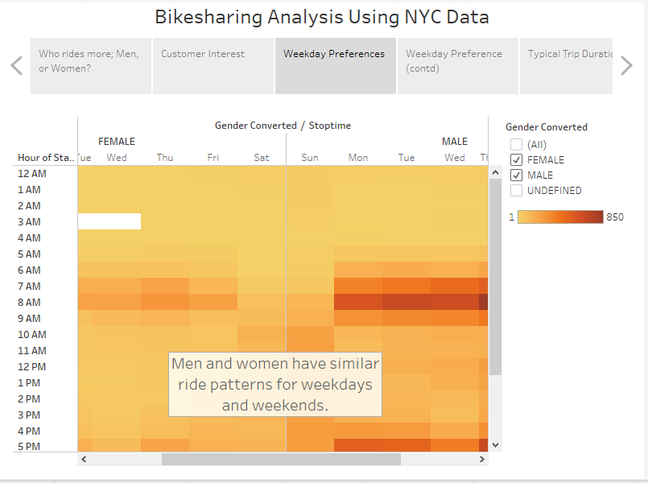

# bikesharing Analysis

## Overview

##### This analysis aims to evaluate Bikesharing data from NYC to determine the suitability or otherwise of a similar business in Des Moines, IA. Des Moines, though not nearly as populated as New York city, is similarly rich in Arts and Culture and therefore attracts a lot of tourists, particularly in the summer months.

## Results

 
##### The Chart above reveals that women ride significantly more than men.

##### This Chart shows that significantly higher number of riders are subscribers to the rideshare service. This implies long-term commitment.
 

##### This Chart shows that most rides last less than 20 minutes.

##### This Chart shows that men and women have similar riding patterns for weekdays and weekends.

##### This Chart shows that customer/ subscriber proportion are similar for most days of the week.

## Summary

##### The results of the analysis strongly suggests that a bikesharing business is likely to thrive in Des Moines almost as well, or probaly better, as it does in New York City given the similarities between the 2 cities.

### Tableu public link: https://public.tableau.com/profile/oyekola.oyedele#!/vizhome/NYC_Bike_Challeng/Story1?publish=yes

[link to dashboard](LINK GOES HERE "https://public.tableau.com/profile/oyekola.oyedele#!/vizhome/NYC_Bike_Challeng/Story1?publish=yes")